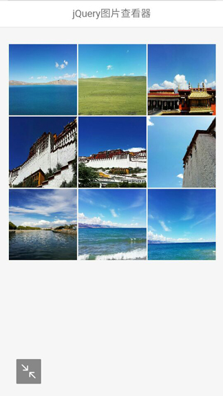
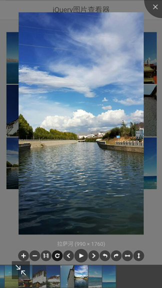
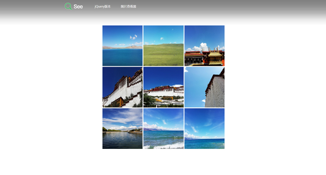
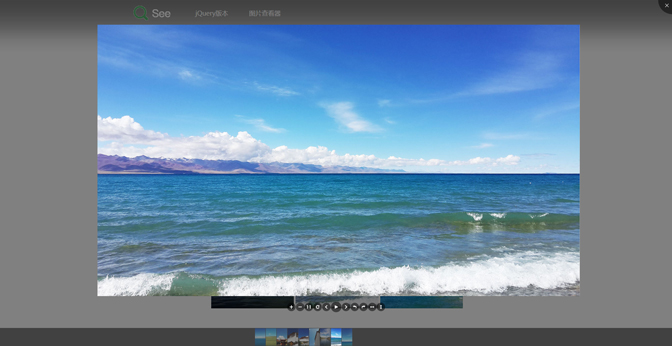

# Viewerjs jQuery图片查看器
## 更新
### Viewer.js 有以下特点：
- 支持移动设备触摸事件
- 支持响应式
- 支持放大/缩小
- 支持旋转（类似微博的图片旋转）
- 支持水平/垂直翻转
- 支持图片移动
- 支持键盘
- 支持全屏幻灯片模式（可做屏保）
- 支持缩略图
- 支持标题显示
- 支持多种自定义事件

## 使用方法
### 载入 CSS 文件
```html
<link rel="stylesheet" type="text/css" href="css/reset.css"/>
<link rel="stylesheet" type="text/css" href="css/viewer.min.css">
<link rel="stylesheet" type="text/css" href="css/mobie.css"/>
```

### DOM底部载入 JavaScript 文件
```html
<script type="text/javascript" src="js/common.js"></script>
<script type="text/javascript" src="js/jquery-1.12.3.js"></script>
<script type="text/javascript" src="js/viewer-jquery.min.js"></script>
<script type="text/javascript" >
        $('#dowebok').viewer({
            url: 'data-original'
        });
</script>
```

### DOM 结构
```html
<ul class="images clearfix" id="dowebok">
    <li class="item"></li>
    <li class="item"></li>
    <li class="item"></li>
    <li class="item"></li>
    <li class="item"></li>
    <li class="item"></li>
    <li class="item"></li>
    <li class="item"></li>
    <li class="item"></li>
</ul>
```


## 移动端效果如下图所示：
<p align="left">
  
  <span>&nbsp;&nbsp;&nbsp;&nbsp;</span> 
  
</p>
## pc端效果如下图所示：
<p align="center">
  
</p>
<p align="center">
  
</p>
**[⬆ 回到顶部](#Viewerjs jQuery图片查看器)**
